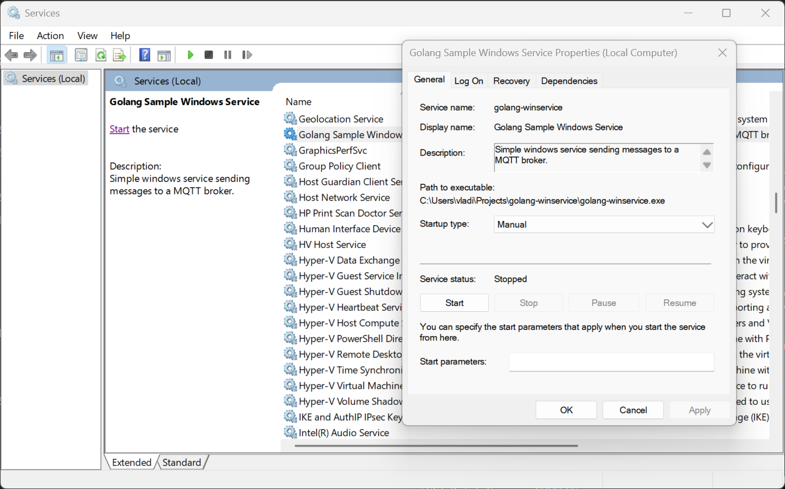

# Go Windows Service

A simple Windows service that, every 2 or 5 seconds, sends a message to a MQTT broker.

## Building and Running

1. Build the application for Windows:

    ```bash
    make build
    ```

1. Register the service (as administrator):

    ```Powershell
    sc.exe create golang-winservice `
        displayname= "Golang Sample Windows Service" `
        binPath= "$((Get-Location).Path)\golang-winservice.exe"
    sc.exe description golang-winservice `
        "Simple windows service sending messages to a MQTT broker."
    ```

1. Create the `C:\ProgramData\golang-winservice\config.yml` configuration file:

    ```yaml
    mqtt:
      broker: tcp://localhost:1883
      topic: test/topic

    intervals:
      fast: 2
      slow: 5
    ```

1. Use the Windows Service Control Manager to start the service.

    

1. Deregister the service (as administrator):

    ```Powershell
    sc.exe delete golang-winservice
    ```
